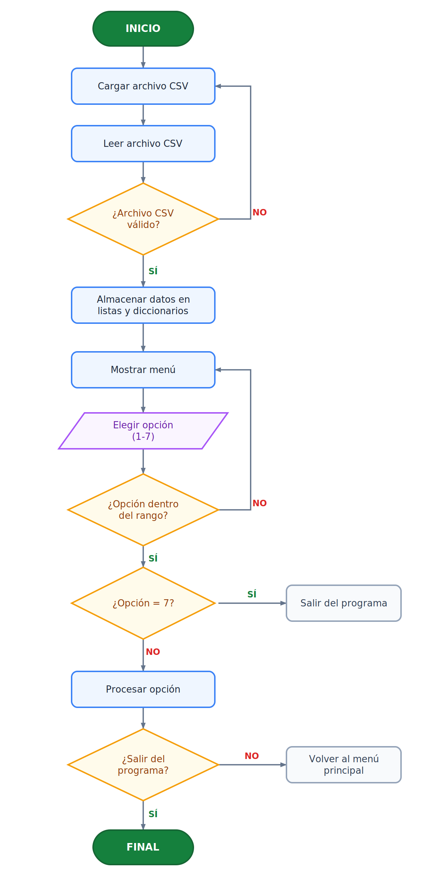
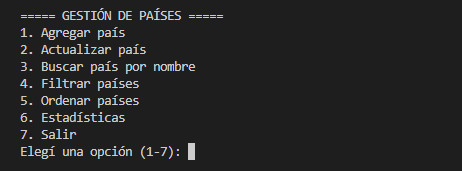
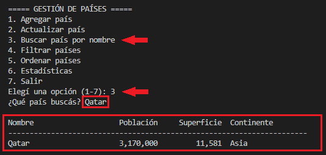
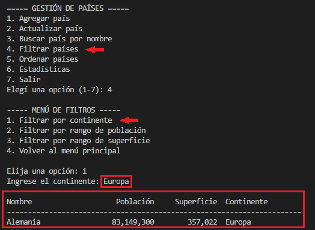
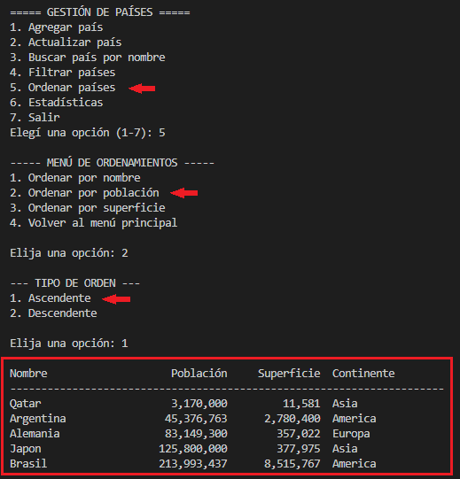
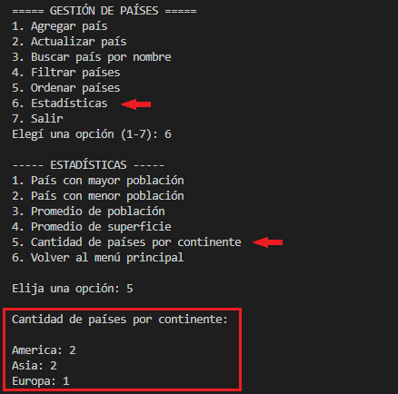

# Gestión de Datos de Países en Python

Trabajo Práctico Integrador — Programación 1
Tecnicatura Universitaria en Programación a Distancia (TUPAD) — UTN

## Integrantes
- Maira Aguirre Gusmán - Comisión 14
- Matias Burgos - Comisión 20


## Descripción
Aplicación de consola en Python para gestionar información de países
(nombre, población, superficie y continente) desde un archivo CSV.
Permite agregar y actualizar países, buscarlos por nombre, filtrarlos,
ordenarlos y generar estadísticas.


## Estructura del proyecto
- `main.py` — menú principal y bucle del programa
- `datos.py` — carga del CSV, alta y actualización de países
- `validaciones.py` — funciones reutilizables de validación de entrada
- `busquedas.py` — busqueda de países por nombre
- `filtros.py` — filtros por continente y por rangos
- `ordenamientos.py` — ordenamientos por distintos criterios
- `estadisticas.py` — cálculo de estadisticas
- `paises.csv` — dataset base

## Diagrama de flujo general del proyecto



## Instrucciones de uso

### Requisitos

- Tener instalado Python 3.x.
- No es necesario instalar librerías externas, el programa incluye las funciones necesarias definidas.
- Es necesario respetar la estructura del proyecto para su correcto funcionamiento.
- Si se quiere modificar la estructura del proyecto, hay que cambiar las rutas relativas.

### Descargar el proyecto

Clonar el repositorio desde GitHub:

```bash
git clone https://github.com/mairaguirre/gestion-paises.git
```
### Consideraciones

- El programa fue desarrollado en Python 3.
- Los datos se leen desde el archivo `paises.csv`.
- Todas las entradas del usuario cuentan con validaciones para evitar errores durante la ejecución.


## Ejemplo de uso
Al ejecutar el programa se presenta el menú principal:



El usuario selecciona una opción ingresando el número correspondiente.

### Búsqueda de un país



El sistema muestra la información del país solicitado.

### Filtrado de países



Se listan únicamente los países que cumplen con el criterio seleccionado.

### Ordenamientos



### Estadísticas



El programa calcula y muestra distintos indicadores del dataset.

## Enlaces
- Documentación en PDF: [Documento PDF](TPI_Programacion1_MairaAguirreGusman_MatiasBurgos.pdf)
- Video explicativo: [](https://www.youtube.com/watch?v=uJnZkPtHoeY)

